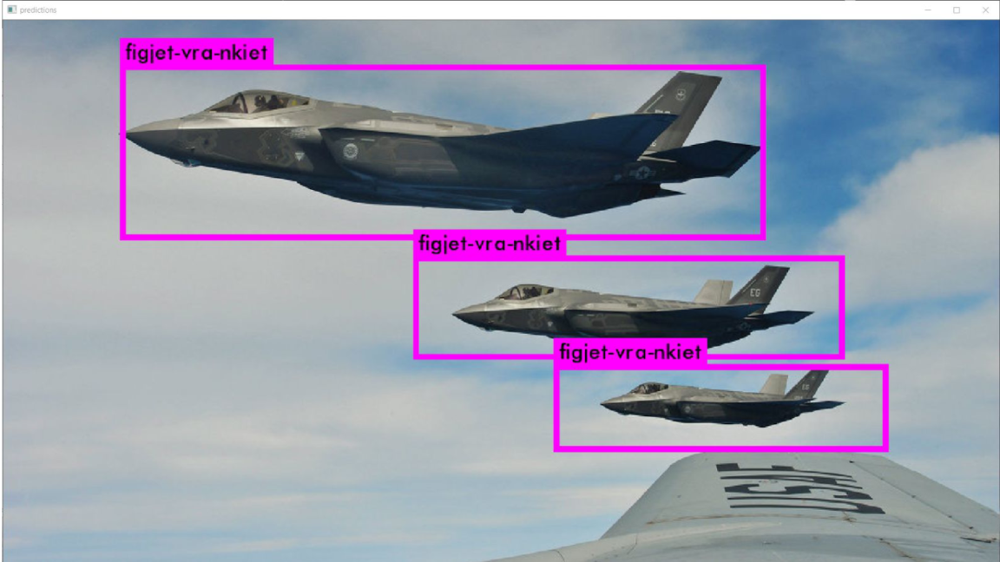
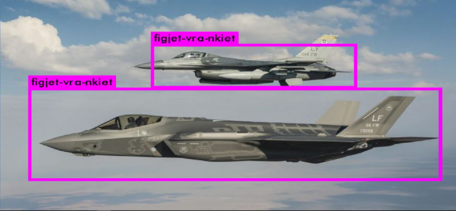
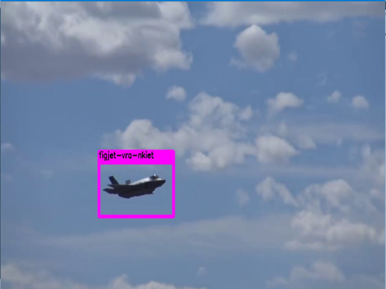
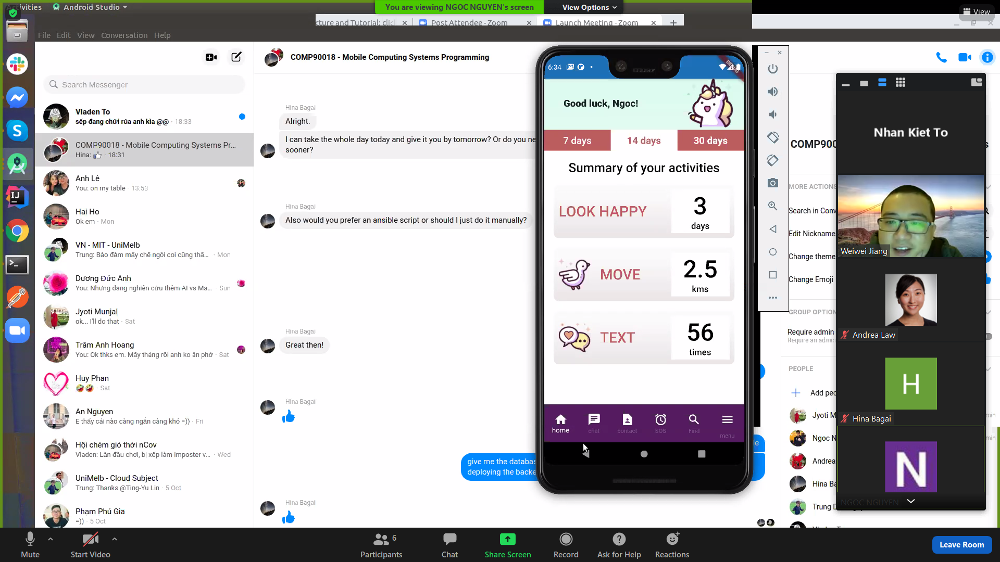
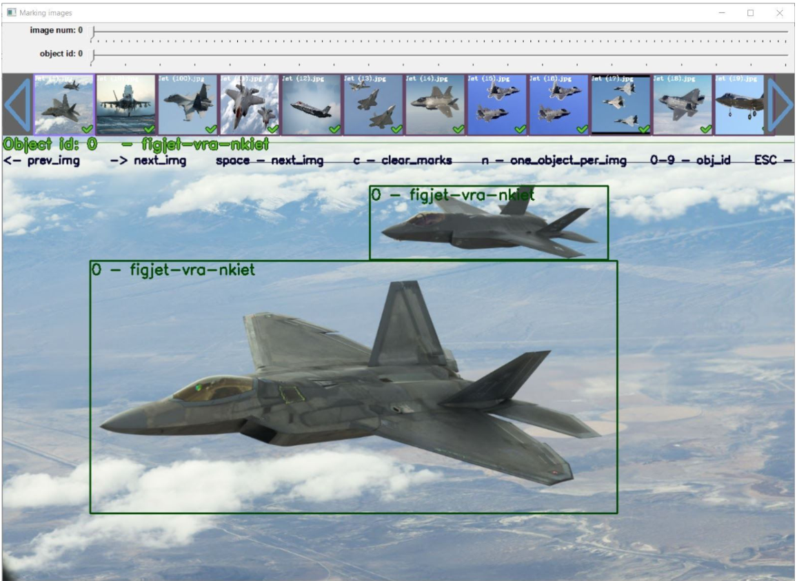

# VRA.ToNhanKiet

A real-time Fighter Plane detector powered by YOLOv2, for practice and research purpose only.

Some sneekpeek images

The detector can be used on either images or video

Training data, about 100 images

Labelling data

Demo video [link](https://drive.google.com/file/d/1eLWlU-KDK-2B5uX-gzwOGa3NyX2pu7A0/view?usp=sharing) (skip to 6:43 to see it in action).

Final project of the Visual Recognition Extra Class in 2017, full marks received.
